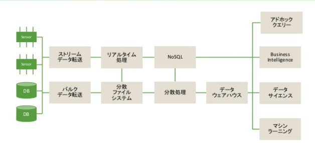
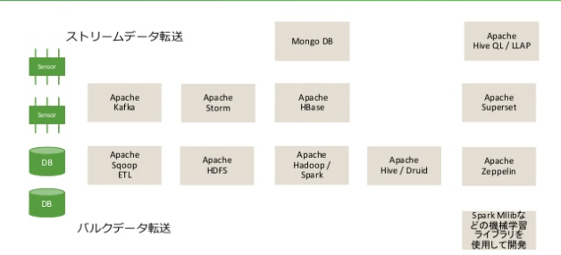
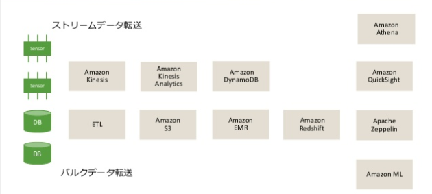
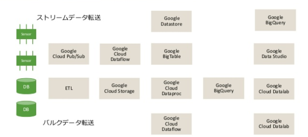
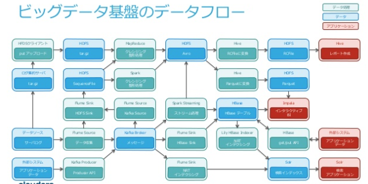
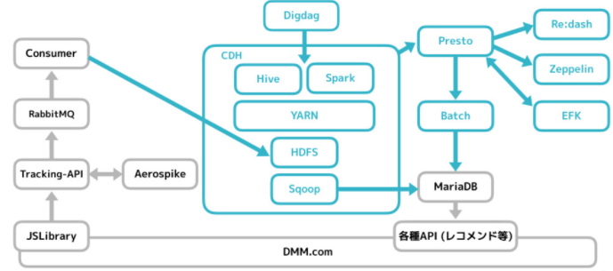

1. 収集
    - 収集すべきデータの定義、的確なデータの収集および管理
2. 変換
    - データの前処理・変換
3. 保存
    - データおよびメタデータ（データに関するデータ）の保存
4. 分析
    - データの分析
5. 表示
    - データの可視化・加工
6. 運用
    - セキュリティ、エラー検出・処理、プライバシー保護など

1. 収集：Fluentd
2. 変換：Fluentd
3. 保存：ElasticSearch
4. 分析：ElasticSearch
5. 表示：Kibana
6. 運用：なんとかする

# DeNA 流データエンジニアリングの極意

1. データレイク と DWH に分けるべし
    - Data Source -> Data Lake -> 統合 DWH
        - Data Source ：DB や Log
        - Data Lake ： 生データ、HDFS,S3
        - 統合 DWH ：意思決定のために目的別に編成され、統合された時系列データベース、BigQuery
2. ストリーミング収集にはバッファを設けるべし
3. Retryable にするべし
4. Validation すべし
5. SQL で分析すべし
6. 再取り込みを容易にすべし

# サービス

|項目|OSS|AWS|Google|
|:---|:---|:---|:---|
|ETL|NiFi,Sqoop,Flume,etc|Amazon Data Pipeline|Cloud Data Prep|
|メッセージング|Kafka|Amazon Kinesis|Cloud Pub/Sub|
|ビッグデータ分散処理|Hadoop, Spark|Amazon EMR|Cloud DataProc,Cloud Dataflow|
|リアルタイムデータ処理|Storm|Amazon Kinesis|-|
|NoSQL|MongoDB,CouchDB,HBase,Casandra,etc|Amazon DynamoDB|Cloud Datastore,Cloud BigTable|
|DWH|Hive / Druid|Amazon Redshift|BigQuery|
|クエリエンジン|Hive,Impala,Presto|Amazon Athena|BigQuery|
|BI|Superset,etc|Amazon QuickSight|Google Data Studio|
|データサイエンス|Zeppelin,Jupyter|Amazon Machine Learning|Cloud DataLab|
|ML|-|Amazon Machine Learning|Cloud Macine Learning Services|

# 構成例

