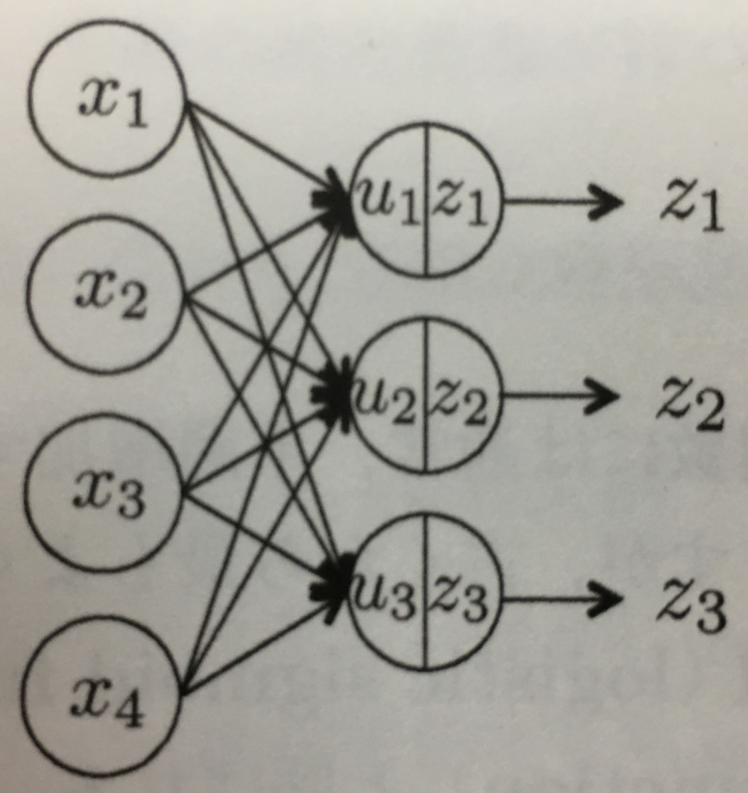
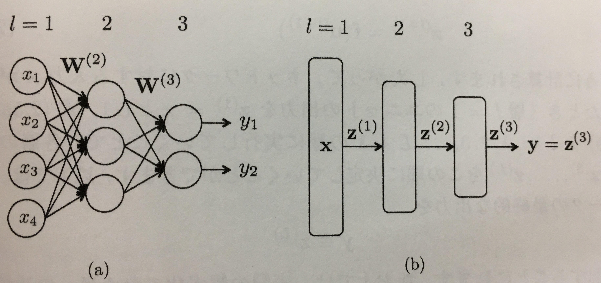
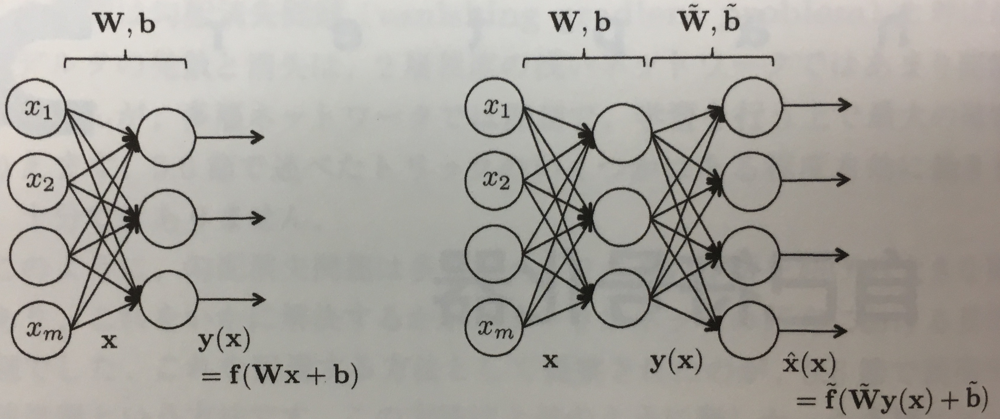
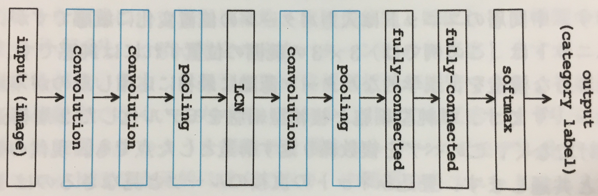
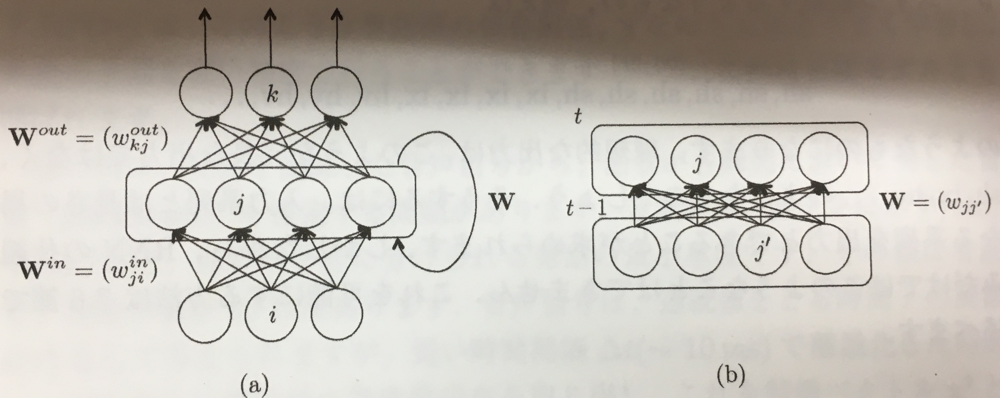
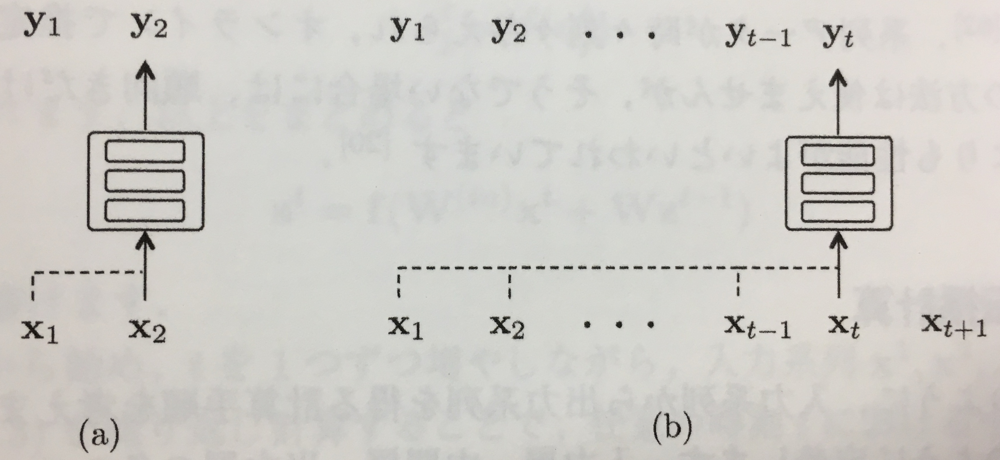

機械学習プロフェッショナルシリーズ 深層学習 DeepLearning  
岡本貴之 講談社

深層学習のネットワークの構造の違いによる大分は以下。
- 順伝播型ネットワーク
- 畳込みニューラルネット
- 再起型ニューラルネット
- ボルツマンマシン

また、ニューラルネットワークは一般に以下の問題に利用する。

- 回帰
- 2クラス分類
- 多クラス分類

上記の他に、 <u>目標の出力を伴わない、入力だけの訓練データを使った教師なし学習により、データをよりよく表す特徴を獲得し、ひいてはデータのよい表現方法を獲得することを目的とする</u> ニューラルネットワークである **自己符号化器** がある。

# 1. はじめに（省略）
# 2. 順伝播型ネットワーク

**順伝播** （ **ニューラル** ） **ネットワーク** （ **feedforward neural network** ）は、層状に並べたユニットが隣接層間でのみ結合した構造を持ち、情報が入力側から出力側に <u>一方向にのみ</u> に伝播するニューラルネットワーク。  **多層パーセプトロン** （ **multi-layer perceptron** ）とも呼ばれる。

上記のように **入力** $x = \{x_1,x_2,...\}$ に対して **重み** $W=\{w_1,w_2,...\}$ を掛けたものに **バイアス** （ **bias** ）と呼ばれる値を足したものを **ユニット** $u=\{u_1,u_2,...\}$ とすると以下のようになる。

$$u=Wx+b$$

そして、上記のユニットの **出力** $z=\{z_1,z_2,...\}$ は、総入力 $u$ に対する **活性化関数** （ **activation function** ）と呼ばれる関数 $f$ の出力である。

$$z=f(u)$$

活性化関数にはいくつか種類があり、 **シグモイド関数** や **ソフトマックス関数** などがある。  
順伝播ネットワークはこれらの層がいくつも並べられ、層間でのみそれらは結合を持つ。

上記のように任意の $l$ 層からなるネットワークを考えた場合の層間の関係を表した式は以下になる。

$$u^{(l+1)}=W^{(l+1)}z^{(l)}+b^{(l+1)}$$
$$z^{(l+1)}=f(u^{(l+1)})$$
$$y=z^{(L)}$$

なお、 <u>各層での活性化関数は同じである必要はない</u> 。  
また、入力 $x$ に対して、出力 $y$ を$y=y(x)$ と表現したとすると、この関数はパラメータ $W$ を持つので以下のように表現できる。（厳密にはバイアル $b$ も持つが省略）

$$y=y(x;w)$$

最終的な出力 $y$ に対して理想的な出力を $d$ とすると、これらの値間には誤差が生じる。この誤差の尺度のことを **誤差関数** （ **error function** ）と呼ぶ。  
ニューラルネットワークを用いて解きたい問題に対して、活性化関数、誤差関数は以下の対応関係がある。

|問題の種別|活性化関数|誤差関数|
|:---|:---|:---|
|回帰|恒等写像|二乗誤差 $E(w)=\frac{1}{2}\sum_{n=1}^N||d_n-y(x_n;w)||^2$ |
|二値分類|ロジスティック関数| $E(w)=-\sum_{n=1}^N[d_n\log y(x_n;w)+(1-d_n)\log \{1-y(x_n;w)\}]$ |
|多クラス分類|ソフトマックス関数|**交差エントロピー** $E(w)=-\sum_{n=1}^N\sum_{k=1}^Kd_{nk}\log y_k(x_n;w)$ |

# 3. 確率的勾配降下法
# 3.1. 勾配降下法

順伝播型ネットワークの学習は与えられた訓練データをもとに誤差関数 $E(w)$ を重み $w$ 、バイアス $b$ について最小化することである。  
$E(w)$ は一般に凸関数ではなく、大域的な最小解を直接求めることは通常不可能である。そこで代わりに $E(w)$ の局所的な極小点 $w$ を求めることを考える。極小点 $w$ は一般的には最適解ではないが、それでも目的の問題をそれなりにうまく解決できるかもしれない。  
このような極小解は、何らかの初期値を出発点に $w$ を繰り返し更新する反復計算によって求める。その方法の1つに **勾配降下法** （ **gradient descent method** ）がある。ここでいう **勾配** （ **descent** ）とは以下である。

$$\bigtriangledown E = \frac{\partial E}{\partial w}$$

つまり、傾きである。  
この傾きに対して **学習係数** （ **learning rate** ） $\epsilon$ の幅ずつ負の勾配方向へ少しずつ動かしていく。

$$w^{(t+1)}=w^{(t)}-\epsilon \bigtriangledown E$$

勾配降下法は最も単純で方法で、同じような最小化手法に、目的関数の2次微分を利用する **ニュートン法** やその派生方法（ **準ニュートン法** など）がある。  
ニュートン法を利用できる場合にわざわざ勾配降下法を利用する必要はないが、問題の規模が大きいとニュートン法では2次微分の計算が難しくなるため、このような場合に勾配降下法は有効である。そしてディープネットの学習はまさに勾配降下法が有効な場合にあたる。

## 3.2. 確率的勾配降下法

訓練サンプルが $n=1,..,N$ あるとする。  
訓練サンプル $n=1$ の誤差関数が $E_1(w)$ 、訓練サンプル $n$ の誤差関数が $E_n(w)$ のように考えると、全訓練サンプルの誤差関数は以下のようになる。

$$E(w)=\sum_{n=1}^N E_n(w)$$

勾配降下法では上記の $E(w)$ を使用しており、この方法を **バッチ学習** （ **batch learning** ）と呼ぶ。  
これに対しサンプルの一部（極端にはサンプル1つ）を用いてパラメータ更新を行う方法があり、これを **確率的勾配降下法** （ **stochastic gradient descent** ; **SGD** ）と呼ぶ。  
あるサンプル $n$ を用いたパラメータの更新は以下になる。

$$w^{(t+1)}=w^{(t)}-\epsilon \bigtriangledown E_n$$

サンプルを毎回取り替え、パラメータを更新していく。  
パラメータの更新をサンプル1つ単位ではなく、少数のサンプルの集合をひとまとめにし、その単位でパラメータ更新を行う方法を **ミニバッチ** （ **minibatch** ）という。

3章で無視したこと。
- 正規化（正規化項 $\frac{\lambda}{2}||w||^2$ を $E(w)$ に足すやつ
- ドロップアウト
- モメンタム（momentum）

# 4. 誤差逆伝播法（省略）
# 5. 自己符号化器

順伝播型ネットワークにおける入力 $x$ 、 重み $W$ 、 バイアス $b$ 、 出力 $y$ の関係は以下であった。

$$y=f(Wx+b)$$

以下のようなネットワークを考える。

出力 $y$ に対し、新たに追加した層の重みを $\tilde{W}$ 、 バイアスを $\tilde{b}$ 、 活性化関数を $\tilde{f}$ 、 出力を $\hat{x}$とした場合、以下の関係が成り立つ。

$$\hat{x}=\tilde{f}(\tilde{W}y+\tilde{b})\\=\tilde{f}(\tilde{W}f(Wx+b)+\tilde{b})$$

入力 $x$ と出力 $\hat{x}$ の値が近くなった場合、中間層の出力 $y$ は $x$ をよりよく符号化したものと考えることができる。  
このとき、最初の変換 $y=f(Wx+b)$ を **符号化** （ **encode** ）、二番目の変換 $\hat{x}=\tilde{f}(\tilde{W}y+\tilde{b})$ を **複合化** （ **decode** ）と呼ぶ。そしてこのようなネットワークを **自己符号化器** （ **autoencoder** ）という。

5章、以降省略。

# 6. 畳込みニューラルネットワーク

これまでの順伝播型ネットワークは、全てのユニットが **全結合** （ **fully-connected** ）されたものであった。  
画像認識でよく用いられる **畳み込みニューラルネットワーク** （ **convolutional neural network** ; **CNN** ）では、隣接層の特定のユニットのみが結合する特別な層を持つ。

- **畳込み層** （ **convolution layer** ）
  - 画像の特徴を **フィルタ** を通して圧縮する層
  - 畳込み層とプーリング層はペアでこの順
- **プーリング層** （ **pooling layer** ）
  - 畳込み層で抽出された特徴の <u>位置感度を若干低下</u> させることで、対象とする特徴量の画像内での位置が若干変化した場合でも、プーリング層の出力が不変になるようにする
  - 畳込み層とプーリング層はペアでこの順
- **局所コントラスト正規化** （ **local contrast normalization** ; **LCN** ）層
  - 入力画像全体の明るさやコントラストの違いをうまく吸収する層
- **全結合層** （ **fully-connected layer** ）

# 7. 再起型ニューラルネット

**再起型ニューラルネット** （ **recurrent neural network** ; **RNN** ）は、音声や言語、動画といった系列データを扱うニューラルネットで、内部に有向閉路をもつものの総称。  
RNNはこの構造のおかげで、情報を一時的に記憶し、また振る舞いを動的に変化させることができる。

上記(a)はRNNの概要を示しており、中間層が自分自身への帰還路をもっていることがわかる。  
上記(b)は帰還路の結合の詳細で、時刻 $t-1$ のユニットの出力が次時刻 $t$ のユニットへの入力になっている。

RNNはデータの系列を受け取り、出力の系列を生成する。  
上記(a)(b)は時刻2および $t$ での入出力の状態で、各時刻に受け取る入力はただ1つだが、その時刻の出力には理論上、それまでの入力に受け取った全ての入力が反映される。

# 8. ボルツマンマシン

**ボルツマンマシン** （ **Boltzmann machine** ）は、ユニット間の結合が双方向性をもつニューラルネットである。  
ネットワークの挙動を確率的に記述することが最大の特徴で、一般にデータの生成モデルとして利用される。

以降省略。
