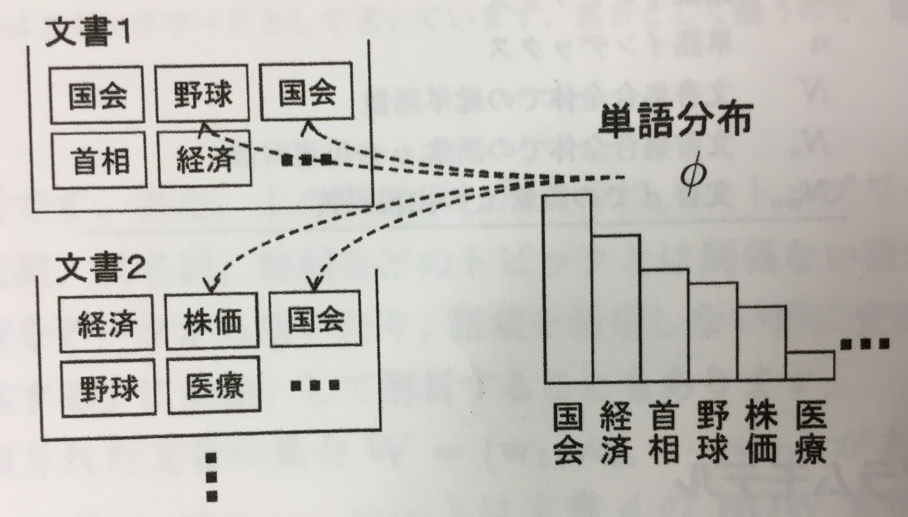

機械学習プロフェッショナルシリーズ「トピックモデル」岩田具治

# 本書を読む前に、自分で整理した前提

トピックモデルは文書データ解析手法で、 **統計的機械学習** に分類される。  
$\{0,1\}$ の2値の $n$ 個からなる観測データ点があったとする。（白黒画像の1ドットをイメージするとよい）  
その観測データを点を $x=\{x_i\in\{0,1\}|i=1,2,...,n\}$ と表す。  
$n$ 個の観測点は $n$ 個の確率変数の同時分布 $p_g(X)$ から確率的に生成されたものと考える。  
$X=\{X_i\in\{0,1\}|i=1,2,...,n\}$ が $n$ 個の確率変数。  
つまり、確率分布 $p_g(X)$ に従ってサンプルされた1つの実現値が観測データ点 $x$ と解釈する。  
（確率変数 $X_i$ に対応する点が $x_i$ と考える。）  
 $p_g(X)$ は対象の観測データ点の確率的な生成規則を規定するものであるから、  $p_g(X)$ は観測データ点の **生成モデル** （ **generative model** ）と呼ばれる。  
 しかし、一般的に観測データ点に対する生成モデルは未知の分布である。  
 この未知のモデルを、受け取った観測データ点の集合を利用して構築するのが **統計的機械学習** （ **statistical machine learning** ）の枠組みである。

 我々は生成モデルの形を知らないので、まずはパラメータ $\theta$ をもった適当な確率モデル $p_g(X|\theta)$ を仮定する。  
 そして、受け取った観測データ点の集合 $\{x^{(1)},x^{(2)},...,x^{(N)}\}$ を利用してパラメータ $\theta$ の値を変えて仮定した学習モデルを調整することで学習モデルの再現を試みる。

# 1. 確率の基礎
## 1.1. 確率
### 1.1.1. 確率と確率分布

確率は **事象** （ **event** ）の起こりやすさを表す。  
ある事象 $A$ が起こる確率を **$p(A)$** と書く。  
サイコロをふったときの目を $X$ とする。こういった **$X$** は **確率変数** （ **random variable** ）という。  
サイコロの場合全ての事象の集合は $\it{X} = \{1,2,3,4,5,6\}$ であり、サイコロをふったときの目が **$x \in \it{X}$** である確率は **$p(X=x)$** もしくは $p(x)$ と書く。  
確率変数の値とその確率を表すものを **確率分布** （ **probability density** ）と呼ぶ。  
サイコロの確率分布は $p(X=1)=p(X=2)=p(X=3)=p(X=4)=p(X=5)=p(X=6)=\frac{1}{6}$ 。  
離散値の集合 $X$ のうちの1つの値をとる **離散確率変数** の場合、以下の性質が成り立つ。

$$0 \leq p(x) \leq 1$$
$$\sum_{x \in \it{X}}p(x)=1$$

### 1.1.2. 同時確率

事象 $A$ と $B$ が同時に起こる確率を **$p(A,B)$** と書き、 **同時確率** （ **joint probability** ）と呼ぶ。  
事象 $A$ が起こっていると分かっている場合に事象 $B$ が起こる確率を **$p(B|A)$** と書き、 **条件付き確率** （ **conditional probability** ）と呼ぶ。  
同時確率と条件付確率の間には **乗法定理** （ **product rule** ）が成り立つ。

$$p(A,B)=p(B|A)p(A)=p(A|B)p(B)$$

### 1.1.3. 周辺化

同時確率 $p(A,B)$ の一方の確率変数　$B$ をその全事象に関して和をとると $p(A)$ になる。

$$p(A)=\sum_B p(A,B)$$

この操作を **周辺化** （ **marginalization** ）と呼び、 $p(A)$ を **周辺確率** （ **marginal probability** ）と呼ぶ。

### 1.1.4. ベイズの定理

情報定理から下記の通り **ベイズの定理** （ **Bayes' theorem** ）を導ける。

$$p(B|A)=\frac{p(A|B)p(B)}{p(A)}$$

また、分母の $p(A)$ は周辺化を用いて変換および計算可能である。

### 1.1.5. 独立

$A$ 、 $B$ の同時確率が 2 つの周辺確率の積で表されるとき、 $A$ と $B$ は **独立** （ **independent** ） であるという。

$$p(A,B)=p(A)p(B)$$

また、 以下が成り立つとき、$A$ と $B$ は $C$ が与えられたもとで **条件付き独立** （ **conditionally independent** ）という。

$$(A,B|C)=p(A|C)p(B|C)$$

すべての変数が違いに依存している場合、適切に条件付き独立を仮定することで、推定が実行可能な確率モデルを設計できる。  
トピックモデルでは、トピックが与えられたもとで単語は条件付き確率であると仮定する。

### 1.1.6. 計算例（省略）
### 1.1.7. 期待値

確率 $p(x)$ に従う $x$ の関数 $f(x)$ の **期待値** （ **expectation** ）は以下で計算できる。

$$E[f]=\sum_{x \in \it{X}} p(x)f(x)$$

これは $f(x)$ を 重み $p(x)$ をつけて足してもの。特に関数が $f(x)=x$ であるときの期待値を **平均** （ **mean** ）と呼ぶ。

$$E[x]=\sum_{x \in \it{X}} p(x)x$$

最も確率が高くなる値を **最頻値** （ **mode** ）という。

$$mode[x]=\argmax_{x \in \it{X}} p(x)$$

平均からのズレの二乗の期待値を **分散** （ **variance** ）と呼ぶ。

$$Var[x]=E[(x-E[x])^2]=E[x^2]-E[x]^2$$

分散は分布の散らばり具合を表す尺度。  
2つの変数の平均からのズレの積の期待を **共分散** （ **covariance** ）と呼ぶ。

$$Cov[x,x']=E[(x-E(x))(x'-E(x'))]$$

共分散は2つの変数の相関を表す尺度。  
共分散が正であれば2つの変数は同じような振る舞いをし、負であれば逆の振る舞いをする。

### 1.1.8. カルバック・ライブラー・ダイバージェンス

確率分布の非類似度として **カルバック・ライブラー・ダイバージェンス** （ **KLダイバージェンス** ; **Kullback-Leibler divergence** , **KL divergence** ）がよく用いられる。  
2つの確率分布 $p(x)$ 、 $q(x)$ のKLダイバージェンスは以下で定義される。

$$KL(p,q)=\sum_x p(x)\log \frac{p(x)}{q(x)}$$

KLダイバージェンスは「 $KL(p,q) \geq 0$ 」を満たし、2つの確率分布が同じである必要十分条件は「 $KL(p,q)=0 \Longleftrightarrow p=q$ 」。  
なお、KLダイバージェンスは「 $KL(p,q) \neq KL(q,p)$ 」であるため、数学的な意味では距離ではない。

### 1.1.9. 連続確率変数

これまでの確率変数は離散値。  
連続確率変数の場合、確率変数 $X$ が $a$ から $b$ の間の値をとる確率は以下で表され、この $p(x)$ を **確率密度関数** （ **probability density function** ）と呼ぶ。

$$p(a \leq \it{X} \leq b)=\int_a^b p(x)dx$$

上記は「 $p(x) \geq 0$ 」、「 $\int_{-\infty}^\infty p(x)dx=1$ 」を満たす。  
連続変数の場合、離散変数に置ける $\sum$ を $\int$ に置き換えることで周辺化や期待値の計算が可能となる。

### 1.1.10. イェンゼンの不等式

$\phi_1,\phi_2,\phi_3,...,\phi_V$ を $\phi_1+\phi_2+\phi_3+...+\phi_V=1$ （ $\sum_{v=1}^V \phi_v=1$ ）を満たす正の実数、 $f(x)$ を上に凸な関数としたとき、以下の **イェンゼンの不等式** が成り立つ。

$$f(\sum_{v=1}^V \phi_vx_v) \geq \sum_{v=1}^V\phi_vf(x_v)$$

### 1.1.11 ラグランジュの未定乗数法

確率モデルのパラメータを推定する時に使われる。  
**ラグランジュの未定乗数法** を用いることにより、制限付きの最大化問題を解くことができる。  
ラグランジュの未定乗数法では、いくつかの変数に対して、いくつかの関数の値を固定するという束縛条件のもとで、別のある1つの関数の極値を求めるという問題を考える。  
各束縛条件に対して定数（未定乗数、Lagrange multiplier）を用意し、これらを係数とする線形結合を新しい関数（未定乗数も新たな変数とする）として考えることで、束縛問題を普通の極値問題として解くことができる方法。

$I$ 個の束縛条件 $g_i(\phi)=0$ （ $i=1,...,I$ ）のもとで $f(\phi)$ を最大にする $\phi$ を求める。

$$\max_\phi f(\phi),　ただし、 g_i(\phi)=0 　（i=1,...I）$$

**ラグランジュ乗数** を $\lambda$ とし、以下のようにおく。

$$F(\phi,\lambda)=f(x)+\sum_{i=1}^I \lambda_ig_i(\phi)$$

このとき以下を満たす $\phi$ と $\lambda=(\lambda_1,...,\lambda_I)$ を見つけることにより条件付きの最大化が可能。

$$\frac{\partial F(\phi,\lambda)}{\partial \phi}=\frac{\partial F(\phi,\lambda)}{\partial \lambda}=0$$

## 1.2 確率分布
### 1.2.1. ベルヌーイ分布

2つの値 $x\in\{1,...,V\}$ をとる変\phi=\{\phi_1,...,\phi_V\}数の確率分布について考える。  
また、ベルヌーイ分布は取りうる値が2つのカテゴリ分布である。  
値が $v$ になる確率が $\phi_v$ である $V$ 種類の離散値から1つの値が生じる試行を $N$ 回行ったときの、それぞれの値が出る回数 $x=(x_1,...,x_V)$ は **多項分布** （ **multinomial distribution** ）に従う。

$$Multinomial(x|N,\phi)=\frac{N!}{x_1!x_2!\cdot\cdot\cdot x_V!}$$
$x=1$ のときの確率を「 $p(x=1)=\phi$ 」とすると「 $p(x=0)=1-\phi$ 」となり、このときの確率分布は **ベルヌーイ分布** （ **Bernoulli destribution** ）となる。

$$Bernoulli(x|\phi)=\phi^x(1-\phi)^{1-x}$$

ベルヌーイ分布の平均は「 $E[x]=\phi$ 」、分散は「 $Var[x]=\phi(1-\phi)$ 」となる。  
ベルヌーイ分布を $N$ 回試行した場合、 $x=1$ となる確率分布は **二項分布** となる。

$$Binomial(x|N,\phi)= \left( \begin{array}{ccc} N\\ x \end{array} \right) \phi^x(1-\phi)^{N-x}$$
$$\left( \begin{array}{ccc} N\\ x \end{array} \right) = \frac{N!}{(N-x)!x!}$$

二項分布の平均は「 $E[x]=N\phi$ 」、分散は「 $Var[x]=N\phi(1-\phi)$ 」となる。  
試行回数が1回のベルヌーイ分布は二項分布と等価となる。

### 1.2.2. カテゴリ分布

複数の離散値 $\{1,2,...,V\}$ から1つの値をとる変数の確率分布について考える。  
値が $v$ となる確率を「 $p(v)=\phi_v$ 」とする。（ただし、 $0\leq\phi_v\leq1$ 、 $\sum_{v=1}^V \phi_v=1$ ）  
このときの確率分布は **カテゴリ分布** （ **categorical distribution** ）と呼ばれる。カテゴリ分布は <u>トピックモデルを構成する基本要素となる分布</u> である。

$$Categorical(x|\phi)=\phi_x$$

ここでは、「 $x\in\{1,...,V\}$ 」「 $\phi=\{\phi_1,...,\phi_V\}$ 」である。  
また、ベルヌーイ分布は取りうる値が2つのカテゴリ分布である。  
値が $v$ になる確率が $\phi_v$ である $V$ 種類の離散値から1つの値が生じる試行を $N$ 回行ったときの、それぞれの値が出る回数 $x=(x_1,...,x_V)$ は **多項分布** （ **multinomial distribution** ）に従う。

$$Multinomial(x|N,\phi)=\frac{N!}{x_1!x_2!\cdot\cdot\cdot x_V!}\prod_{v=1}^V\phi_v^{x_v}$$

ここで $x_v$ は値 $v$ が出る回数を表す。  
多項分布の平均は「 $E[x_v]=N\phi_v$ 」、分散は「 $Var[x_v]=N\phi_v(1-\phi_v)$ 」となる。  
また、試行回数が1回の多項分布とカテゴリ分布は等価である。  
さらに変数の取りうる値が2種類（ $V=2$ ）の場合の多項分布は二項分布と等価である。

### 1.2.3. ベータ分布

まだ見てない。

### 1.2.4. ディレクトリ分布

まだ見てない。

# 2. ユニグラムモデル

## 2.1. 文書表現

トピックモデルでは文書を、そのなかに出現する単語の **多重集合** （ **バッグ** 、 **bag** ）で表す。多重集合は出現する単語の語彙の重複を許す。同じ語彙が2回現れる場合も、2つの別々の単語として扱う。このような文章を **BOW** （ **bag-of-words** 、 **バグオブワーズ** ）表現と呼ぶ。BOW表現は単語の並びに関する情報はない。  
日本語の場合は、形態素解析器を用いて文を単語に分割する。また、ストップワードと呼ばれる前置詞、冠詞、代名詞、助詞などのトピックとは関係ない語彙や出現回数の少ない語を省いたり、語彙を活用しない形に変換することもある。  

BOW表現された文書の集合 $W=(w_1,w_2,...w_D)$ があるとする。  
$w_d=(w_{d1},w_{d2},...,w_{dN_d})$ は文書 $d$ のBOW表現で $w_{dn}\in\{1,...,V\}$ は文書 $d$ の $n$ 番目の単語のインデックス、 $N_d$ は文書 $d$ に含まれる単語数、 $V$ は語彙数を表す。記号の意味を以下にまとめる。

|記号|説明|
|:---|:---|
| $D$ |文書数|
| $N_d$ |文書 $d$ に含まれる単語数（文書長）|
| $V$ |全文書の中で現れる単語の種類数（語彙数）|
| $W$ |文書集合|
| $w_d$ |文書 $d$ の単語集合|
| $w_{dn}$ |文書 $d$ の $n$ 番目の単語|
| $d$ |文書インデックス|
| $v$ |語彙インデックス|
| $n$ |単語インデックス|
| $N$ |文書集合全体での総単語数|
| $N_v$ |文書集合全体での語彙 $v$ の出現回数|
| $N_{dv}$ |文書 $d$ での語彙 $v$ の出現回数|

## 2.2. ユニグラムモデル

トピックモデルは、BOW表現された文書集合を確率的生成するための確率モデルである。  
データを生成する確率モデルを **生成モデル** （ **generative model** ）と呼ぶ。  
BOW表現された文書集合の最も簡単な生成モデルに **ユニグラムモデル** （ **unigram model** ）がある。  
ユニグラムモデルでは、全ての文書に現れる単語の出現確率・分布は同一であると仮定する。（後述の混合ユニグラムモデル、トピックモデルでは、各文書の分布は異なるものと仮定する。）

ユニグラムモデルの文書集合 $W$ の **生成過程** （ **generative process** ）を以下に示す。

上記のように数え上げることで単語とその出現個数はわかる。これが **観測データ** である。  
しかし、観測データからはその文書が生み出される生成モデル、つまり、 <u>単語の出現確率はわからない</u> 。  
ユニグラムモデルでは、すべての単語はある1つの **カテゴリ分布** **$Categorical(\phi)$** に従って生成されると仮定する。  
$\phi$ は **$\phi=(\phi_1,...,\phi_V)$** であり、 **$\phi_v$ は単語 $v$ が出現する確率** を表し、 $\phi_v\geq0,　\sum_{v=1}^V \phi_v=1$ を満たす。  
この **$\phi=(\phi_1,...,\phi_V)$** を求めることができれば、ユニグラムモデルでの生成モデルを求めることができる。

現状では我々は生成モデルの形を知らないので、パラメータ $\phi$ を持った適当な確率モデル、文書集合 $W$ の生成確率を表すユニグラムモデル $p(W|\phi)$ を以下のように仮定する。  

$$p(W|\phi)=\prod_{d=1}^Dp(w_d|\phi)=\prod_{d=1}^D\prod_{n=1}^{N_d}p(w_{dn}|\phi)=\prod_{d=1}^D\prod_{n=1}^{N_d}\phi_{w_{dn}}=\prod_{v=1}^V \phi_v^{N_v}$$

上記の式の変換には以下を使用している。

- $\prod_{n=1}^Nx = x \times x ... \times x$ （ $x$ を $N$ 回掛け算）
- $p(W|\phi)=p(w_1,...,w_D|\phi)=\prod_{d=1}^Dp(w_{d}|\phi)$
- $p(w_d|\phi)=p(w_{d1},...,w_{dN_d})=\prod_{n=1}^{N_d}p(w_{dn}|\phi)$
- $p(w_{dn}|\phi)=\phi_{w_{dn}}$
  - $\phi_v$ は単語 $v$ が出現する確率、$w_{dn}$ は文書 $d$ の $n$ 番目の単語なので
- $\prod_{d=1}^D\prod_{n=1}^{N_d}=\prod_{v=1}^V$
  - $N_v$ は語彙 $v$ が全文書の中で現れた回数を表すため

観測データを用いてユニグラムモデルのパラメータ $\phi=(\phi_1,...,\phi_V)$ を求める方法には以下がある。

- 最尤推定
- 最大事後確率推定
- ベイズ推定

## 2.3. 最尤推定

尤度推定では、 **尤度** （ **likelihold** ）が最も高くなるようにパラメータを推定する。尤度はある確率モデルから観測されたデータが生成される尤もらしさを表す数値である。  
尤度は条件付き確率 $p(W|\phi)$ を $\phi$ の関数とみなしたものになる。尤度を以下のように定義する。

$$ {argmax}_{\phi} \log p(W|\phi),　ただし、\sum_{v=1}^V \phi_v = 1$$

上記は $p(W|\phi)$ の対数をとることで単調増加な関数に変換している。  
制限付きの最大化問題を解くことができる **ラグランジュの未定乗数法** を適用することにより、尤度 $\log p(W|\phi)$ の最大値を求める。

$$F=\log p(W|\phi)+\lambda(\sum_{v=1}^V (\phi-1))$$

上記の両辺を $\phi_v$ について偏微分すると以下になる。

$$\frac{\partial F}{\partial \phi_v}=\frac{N_v}{\phi_v}+\lambda=0$$

上記はラグランジュの未定乗数法の条件により $0$ となり以下が導ける。

$$\phi_v=-\frac{N_v}{\lambda}$$

上記の両辺に $\sum_{v=1}^V$ をとると、 $\sum_{v=1}^V \phi_v=1$ であるため、以下となる。

$$\lambda=-N$$

以上のことから $\phi_v=-\frac{N_v}{\lambda}$ と $\lambda=-N$ から以下が導ける。

$$\phi_v=\frac{N_v}{N}$$

上記の結果を用いてユニグラムを最尤推定で解くPythonでの実装例は[ここ](http://nzw0301.github.io/2015/12/unigram-reimplementation)。

## 2.4. 最大事後確率推定（一旦省略）

**最大事後確率** （ **mazimum a posteriori** , **MAP** ） **推定**

## 2.5. ベイス推定（一旦省略）
## 2.6. ベイス予測分布（一旦省略）
## 2.7. パイパーパラメータ推定（一旦省略）
## 2.8. モデル洗濯（一旦省略）

# 3. 混合ユニグラムモデル

## 3.1. 混合ユニグラムモデル

ユニグラムモデルでは、すべての文書においてすべての単語が同じ分布から生成されると仮定した。  
しかし、実際の文書を見てみると、文書によって語彙の使われ安さは異なる。つまり、文書のトピックによって、単語の出現確率は変わる。  
このような文書のトピックを表現するための生成モデルとして、 **混合ユニグラムモデル** （ **mixture of unigram models** ）がある。  
混合ユニグラムモデルでは、トピック毎（文書毎）に異なった生成モデルを持っていると考える。  
ユニグラムモデルの文書集合 $W$ の **生成過程** （ **generative process** ）を以下に示す。

トピック $k$ の単語分布を $\phi_k=(\phi_{k1},\phi_{k2},...,\phi_{kV})$ とする。  
 $\phi_{kv}=p(v|\phi_k)$ はトピック $k$ において語彙 $v$ が出現する確率であり、 $\sum_{v=1}^V \phi_{kv}=1$ である。  
また、それぞれの文書は1つのトピック「 $z_d\in\{1,2,...,K\}$ 」を持ち、単語はその文書のトピックの単語分布 $\phi_{z_d}$ に従って生成される仮定する。  
$\theta_k=p(k|\theta)$ は文書にトピック $k$ が割り当てられる確率で、「 $\sum_{k=1}^K\theta_k=1$ 」を満たし、「 $\theta=(\theta_1,...,\theta_k,...,\theta_K)$ 」をトピック分布と呼ぶ。
MAP推定やベイズ推定のためにパラメータ $\theta$ 、 $\Phi=(\phi_1,...\phi_K)$ の生成過程を含めおり、共役事前分布である **ディレクトリ分布** から生成されると仮定する。  
パラメータ $\theta$ 、 $\Phi$ が与えられたときの文書 $w_d$ の確率は以下となる。

$$p(w_d|\theta,\Phi)=\sum_{k=1}^Kp(w_d,z_d=k|\theta,\Phi)=\sum_{k=1}^Kp(z_d=k|\theta)p(w_d|\phi_k)=\sum_{k=1}^K\theta_k\prod_{m=1}^{N_d}\phi_{kw_{dn}}=\sum_{k=1}^K\theta_k\prod_{v=1}^{V}\phi_{kv}^{N_{dv}}$$

上記の式の変換には以下を使用している。

- 文書 $w_d$ とそのトピック $k$ の同時分布 $p(w_d,z_d|\theta,\Phi)$ をトピック $z_d$ に関して周辺化したものは、文書 $w_d$ の確率 $p(w_d|\theta,\Phi)$ と等しい
- トピック $k$ はトピック分布 $\theta$ から生成され、文書 $w_d$ はトピック $k$ が与えられたら単語分布 $\phi_k$ から生成されるという生成過程に従って分解
- 単語分布 $\phi_k$ が与えられたとき各単語は独立である「 $p(w_d|\phi_k)=p(w_{d1},...,w_{dN_d})=\prod_{n=1}^{N_d}\phi_{kw_{dn}}$ 」

観測データを用いて混合ユニグラムモデルのパラメータ $$ を求める方法には以下がある。

- EMアルゴリズム
- 変分ベイズ推定
- ギブスサンプリング

# 4. トピックモデル
# 5. トピックモデルの拡張：他の情報も利用する
# 6. トピックモデルの拡張：トピックに構造を入れる
# 7. 文書以外のデータへの適用
# 8. トピック数の推定
# 付録A. 代表的な確率分布
## ベルヌーイ分布
## カテゴリ分布
## 正規分布
## 多次元正規分布
## ポアソン分布
## 指数分布
## ガンマ分布
## ウィッシャード分布
## ベータ分布
## ディリクレ分布
